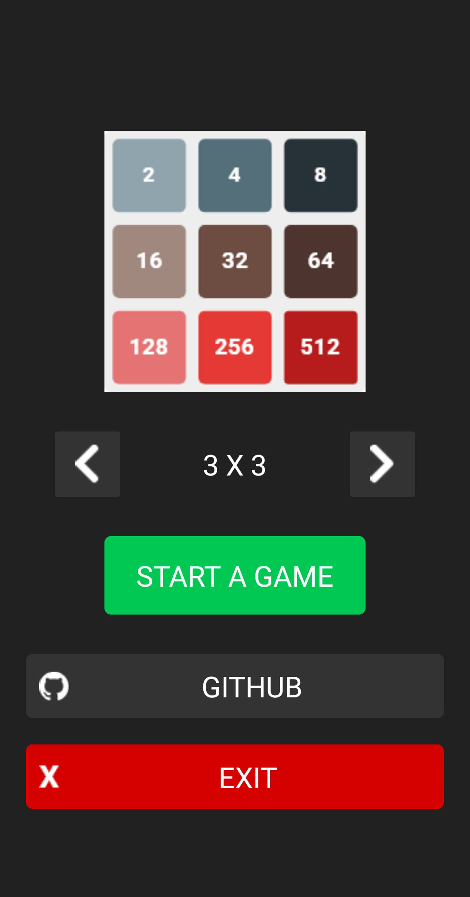
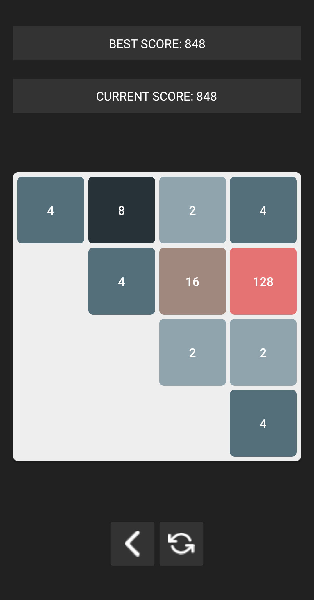
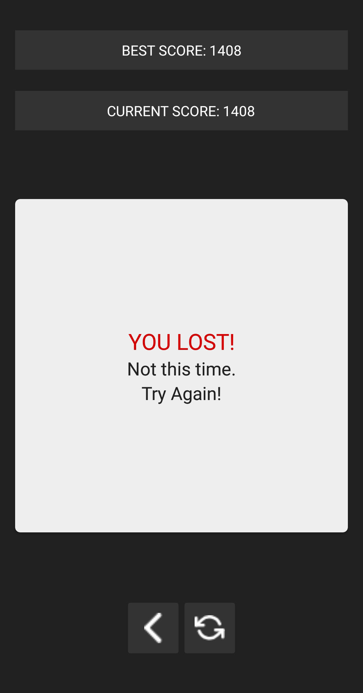

#2048

A mobile game for smartphones with Android or iOS made by me on Xamarin.Forms.
I was also using ReactiveUI Framework for implementing MVVM pattern.

This Project was a great opportunity for me to refresh my knowledge about Xamarin and to get me more familiar with MVVM.

Development of this project was also a chance for me to practise writing Unit Tests.
I wrote them using NUnit Framework and NSubstitute library.

### Images

### Credits

I'm very grateful to Kamil Gloc.
He's a young graphics designer who designed UI concepts for me.
You can check more of his works here:

https://www.facebook.com/Kamil-Gloc-Graphic-Designer-850885198419471/ 

https://dribbble.com/Kamil_Gloc